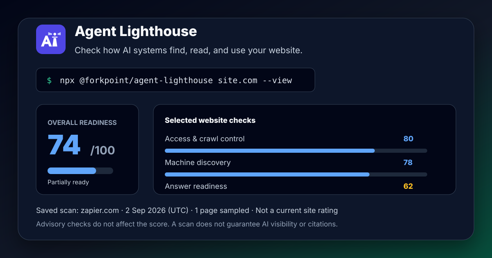

<div align="center">
  <h1>🗼 Agent Lighthouse</h1>
  <p><strong>Lighthouse, but for AI agents.</strong></p>
  <p>Audit whether ChatGPT, Claude, Perplexity, MCP clients, AI crawlers, and agentic browsers can discover, parse, cite, and act on your website.</p>
  <p>
    <a href="https://www.npmjs.com/package/@forkpoint/agent-lighthouse"></a>
    <a href="https://www.npmjs.com/package/@forkpoint/agent-lighthouse"></a>
    <a href="https://github.com/ForkPoint/agent-lighthouse/actions/workflows/ci.yml"></a>
    <a href="https://forkpoint.github.io/agent-lighthouse/"></a>
    <a href="./LICENSE"></a>
  </p>
  <p>
    <a href="https://forkpoint.github.io/agent-lighthouse/">Documentation</a>
    ·
    <a href="https://www.npmjs.com/package/@forkpoint/agent-lighthouse">npm</a>
    ·
    <a href="https://github.com/ForkPoint/agent-lighthouse/issues/new?template=site-score.yml">Share a site score</a>
  </p>
</div>



---

## ⚡ Quickstart

Run a zero-install scan directly in your terminal. The `--view` flag opens the standalone HTML report for screenshots, stakeholder review, and pull-request artifacts.

```bash
# Instant audit (prints terminal report & generates HTML + JSON reports)
npx @forkpoint/agent-lighthouse https://yourstore.com

# Open the standalone HTML report in your browser
npx @forkpoint/agent-lighthouse https://yourstore.com --view

# Run in CI and fail if score is below threshold
npx @forkpoint/agent-lighthouse https://staging.yourstore.com --min-score 85
```

Agent Lighthouse checks 215 audits covering `llms.txt`, robots.txt crawler policy, Schema.org, OpenAPI discovery, WebMCP action surfaces, AEO/GEO content structure, agentic commerce, and operability.

---

## 🎯 What Agent Lighthouse Checks

Agent Lighthouse evaluates websites across **8 agent-journey categories** grouped into **3 readiness pillars**:

```
├── 1. Agentic Readiness
│   ├── Access & Crawl Control (robots.txt rules for GPTBot, ClaudeBot, PerplexityBot, blocks, status codes)
│   ├── Machine Discovery (llms.txt, llms-full.txt, sitemaps, feeds, .well-known surfaces)
│   ├── Agent Interfaces (WebMCP manifests, OpenAPI specs, agents.json, search actions)
│   └── Agentic Commerce (product offers, availability, checkout and payment surfaces)
│
├── 2. AI Search Optimization
│   ├── Content Extraction (clean main content, semantic structure, render and response cost)
│   ├── Structured Data (Schema.org Product, Offer, SKU, GTIN, Organization, JSON-LD validity)
│   └── Answer Readiness (direct answerability, step lists, tables, unique data, citations)
│
└── 3. Technical Foundation
    └── Agent Operability & Safety (HTTPS, security.txt, tdmrep, stability, broken agent endpoints)
```

---

## 📦 Packages & Architecture

This repository is organized as a lightweight pnpm monorepo published under the **`@forkpoint`** scope:

| Package               | npm Package                                                                                              | Description                                                     |
| :-------------------- | :------------------------------------------------------------------------------------------------------- | :-------------------------------------------------------------- |
| **`packages/cli`**    | [`@forkpoint/agent-lighthouse`](https://www.npmjs.com/package/@forkpoint/agent-lighthouse)               | Main CLI binary (`npx @forkpoint/agent-lighthouse <url>`).      |
| **`packages/core`**   | [`@forkpoint/agent-lighthouse-core`](https://www.npmjs.com/package/@forkpoint/agent-lighthouse-core)     | Core gatherer-audit engine, scoring algorithms, and types.      |
| **`packages/report`** | [`@forkpoint/agent-lighthouse-report`](https://www.npmjs.com/package/@forkpoint/agent-lighthouse-report) | Standalone HTML, Markdown, and unified report view-model.       |
| **`packages/mcp`**    | [`@forkpoint/agent-lighthouse-mcp`](https://www.npmjs.com/package/@forkpoint/agent-lighthouse-mcp)       | Model Context Protocol (MCP) server for Claude / Cursor / IDEs. |

---

## 🛡️ GitHub Actions CI

Use Agent Lighthouse as a pull-request gate for agentic readiness regressions:

```yaml
name: Agent Lighthouse

on:
  pull_request:
    branches: [main]

jobs:
  agent-lighthouse:
    runs-on: ubuntu-latest
    steps:
      - uses: actions/checkout@v4

      - uses: ForkPoint/agent-lighthouse@main
        with:
          url: https://staging.yourstore.com
          preset: ecommerce
          min-score: "85"
          github-token: ${{ secrets.GITHUB_TOKEN }}
```

The action generates terminal, HTML, JSON, and Markdown reports. Set `comment-on-pr: true` with `github-token` to post the Markdown summary on pull requests. See the [marketplace setup guide](docs/ACTION_MARKETPLACE.md) for release-ready examples.

---

## 💻 Programmatic Node.js / TypeScript SDK

```typescript
import { runScan } from "@forkpoint/agent-lighthouse-core";
import {
  buildReportView,
  generateHtmlReport,
} from "@forkpoint/agent-lighthouse-report";

const report = await runScan("https://example.com");
const view = buildReportView(report);

console.log(`Overall Score: ${view.overallScore}/100 (${view.scoreTier})`);

// Generate standalone HTML report
const html = generateHtmlReport(report);
```

---

## 🤖 Model Context Protocol (MCP) Server

Add Agent Lighthouse to your Claude Desktop or Cursor IDE to let AI coding agents audit live staging URLs:

```json
{
  "mcpServers": {
    "agent-lighthouse": {
      "command": "npx",
      "args": ["-y", "@forkpoint/agent-lighthouse-mcp"]
    }
  }
}
```

---

## 📣 Share Your Score

Generated reports are standalone files, so teams can attach them to pull requests, send them to clients, or publish before/after improvements.

```markdown
[](https://github.com/ForkPoint/agent-lighthouse)
```

If you run Agent Lighthouse on a public site, share the result through the [site score template](https://github.com/ForkPoint/agent-lighthouse/issues/new?template=site-score.yml). Good examples help other developers learn what agent-ready sites look like.

More launch material lives in:

- [Promotion kit](docs/PROMOTION.md)
- [Benchmark report](docs/BENCHMARK.md)
- [Badge generator notes](docs/BADGE.md)
- [Launch post drafts](docs/launch-posts/)
- [Outreach templates](docs/outreach/)
- [Terminal demo transcript](docs/assets/terminal-demo.txt)
- [Docs homepage screenshot](docs/assets/docs-home-screenshot.png)
- [Generated report screenshot](docs/assets/report-screenshot.png)
- [Badge generator screenshot](docs/assets/badge-generator-screenshot.png)
- [Report preview asset](docs/assets/report-preview.svg)
- [MCP setup screenshot asset](docs/assets/mcp-setup.svg)

---

## 🛠️ Development

```bash
# Clone the repository
git clone https://github.com/ForkPoint/agent-lighthouse.git
cd agent-lighthouse

# Install dependencies
pnpm install

# Build all packages
pnpm build

# Run unit tests
pnpm test
```

---

## 📄 License

Apache-2.0 © [ForkPoint](https://github.com/ForkPoint)
