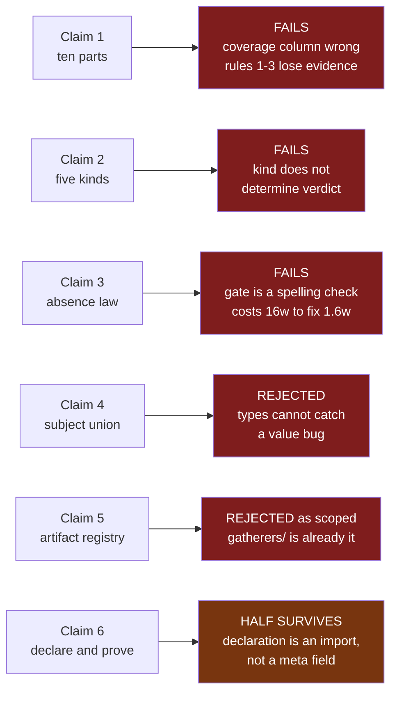
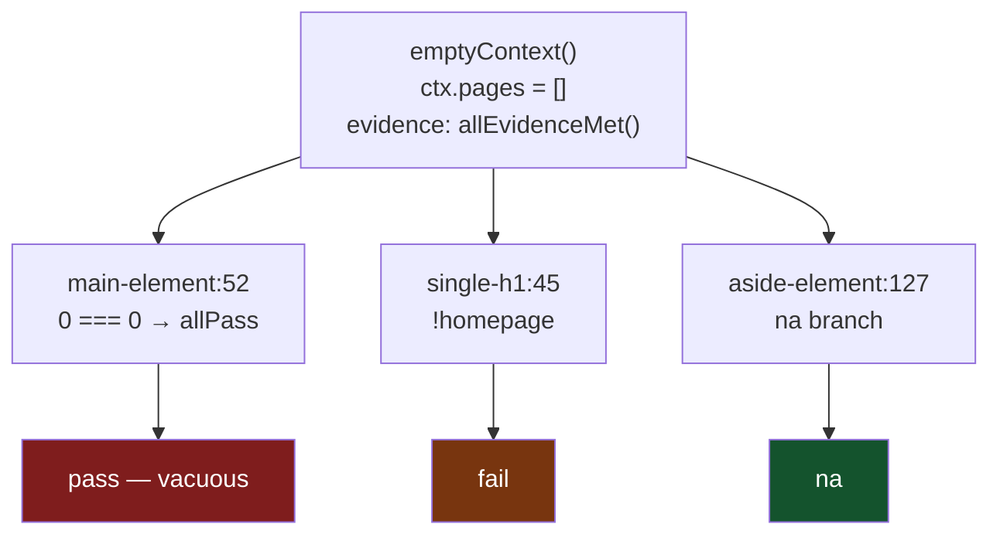
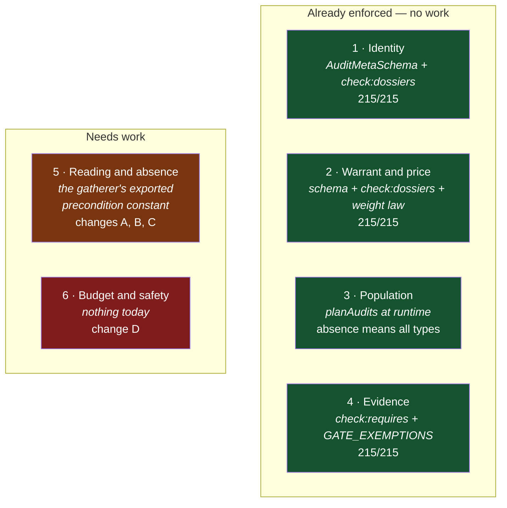
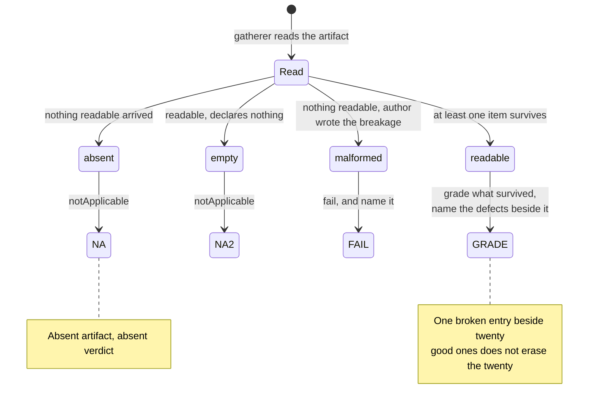
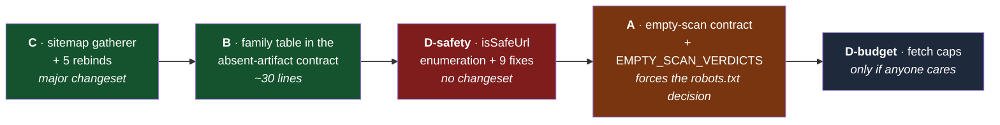

# Audit architecture: proposal, review, and replacement model

**Date:** 2026-08-30
**Status:** review document — not an approved design, and nothing here has been implemented
**Trigger:** dissatisfaction with the execution of `fix/absent-artifact-is-not-a-failure` (PR 23), which took seven stacked commits, each correcting the previous one, to get a single artifact family right

This document records three things in order: an architecture proposal, an adversarial review that measured it against the real registry, and the smaller model that survived. It is written to be read start to finish. Section 9 is the part that turns into work.

---

---

## 0. Corrections issued after publication

Two claims in this document are wrong. Both were produced by a defective test
fixture, discovered on 2026-08-30 while explaining law 6 in
[`2026-08-30-audit-architecture-quiz.md`](./2026-08-30-audit-architecture-quiz.md).

`emptyContext()` builds its evidence from `allEvidenceMet()`, setting
`judgeable: true` and `usablePageTypes: ALL_PAGE_TYPES`, while supplying zero
pages. It asserts that nothing was read and everything was read at once.
`buildScanEvidence` never produces that state. Audits therefore walk past their
own correct `scanReadTheSite` guard and read pages that are not there.

**Retraction 1 — the seven vacuous passes do not exist.** Re-measured against a
truthful unreachable fixture (`judgeable: false`): 153 `na`, 38 `fail`, 24
`warn`, **0 `pass`**. `content-extraction/main-element`, `article-element`,
`header-footer`, `data-tables`, `content-depth`, `figure-figcaption` and
`fake-headings` all decline correctly. Affects §5.1, §9 step 4, §11 question 3.

**Retraction 2 — the counterexample in §6.2 is invalid.** On a truthful
fixture all three audits return `na`:

```
content-extraction/single-h1      -> na
content-extraction/main-element   -> na
content-extraction/aside-element  -> na
```

They diverged only because the fixture claimed the site had been read. §6.2's
verdict of "fails, **decisively**" rested on that divergence and is no longer
earned.

**What this does not do.** It does not revive the five-kind taxonomy. Four
independent arguments in §6.2 stand untouched: audits that fit no kind
(cross-artifact coherence, third-party artifacts, differential audits, per-URL
artifacts); audits that fit two (`search-endpoint`, `contact-form`); the
`page-content` row forcing 23 a11y audits to fail a page for lacking a
`<dialog>`, which is about element absence and not scan absence; and §6.3's
pricing, where the absence law costs ~16 weight to repair 1.6. The taxonomy is
still rejected. It is rejected on those grounds, not on the counterexample.

**Also corrected:** the non-`na` figure of 81 was inflated by 19 for the same
reason. The true figure is 62.

---

## 1. Why this exists

PR 23 fixed a real bug. Four `openapi-*` audits returned `fail` on every site that publishes no OpenAPI document — 2.4 combined weight telling a bakery to add a `servers` array to a spec it had never written.

The fix was correct. The path to it was not:

```
d1a3127  docs: correct the changeset and annotate a superseded fold row
b067d93  fix(core): the OpenAPI decline states what the read observed
bf57929  fix(core)!: grade the OpenAPI operations that are readable
7ac1d32  fix(core): a broken path item does not hide the operations beside it
9d9781d  docs(changeset): all three audits reported "0 operations", not two
4ce8809  docs: correct the priority claim and sharpen the absence rule
8c2cd8d  refactor(core): finish the OpenAPI collapse, enrol the exemplar
d963056  fix(core)!: a malformed OpenAPI paths object fails, an absent one declines
```

Seven commits, each a correction of the one before. The question this document answers is not "was the fix right" — it was. The question is **what rule, stated once, would have produced it in one pass, and what would have found the next instance without anyone hitting it.**

The stated dissatisfaction, in the user's own selection, was two things:

1. **Rules unenforced.** `CLAUDE.md` states laws that no script checks.
2. **No model of what an audit is.** No shared vocabulary, so every audit invents its own absence handling.

Both turned out to be half right, in interesting ways. Section 5 shows which half.

---

## 2. Method, and how to read the confidence markers

Every factual claim below carries one of three markers:

| marker | meaning |
|:--|:--|
| **[verified]** | Confirmed directly against the code in this session, with the file and line named |
| **[measured]** | Produced by the reviewing agent running all 215 registered audits against synthetic scan contexts; not independently re-run |
| **[unverified]** | Asserted by the review, plausible, not yet proven. Listed in §11 as work to do before it enters a spec |

The reviewing agent read the code, rebuilt `packages/core`, and executed every registered audit against two contexts. Its counts are marked **[measured]**. Where its claims contradicted the original proposal's facts, those contradictions were re-checked by hand and are marked **[verified]**.

---

## 3. The proposal that was reviewed

Six claims, developed across the conversation before any measurement was done.

### Claim 1 — an audit is ten declared parts

Each part has one home and one gate. Parts without a gate rot.

| # | part | question it answers | declared in | gate | claimed coverage |
|--:|:--|:--|:--|:--|:--|
| 1 | Identity | which audit is this | `meta.id`, `.category`, `.dossier` | `check:dossiers` | 229/229 |
| 2 | Warrant | which documented consumer licenses the claim | dossier `sources:`, `meta.evidenceGrade` | `check:dossiers` | 199/229 |
| 3 | Population | which sites the claim covers | `meta.applicablePageTypes` | none | 35/229 |
| 4 | Evidence | what the scan must have obtained | `meta.requires` | `check:requires` | 199/229 |
| 5 | Reading | which bytes, through which gatherer | implicit | inferred | — |
| 6 | Subject | what the claim is *about* | **new** `meta.subject` | none | 0/229 |
| 7 | Verdict | legal statuses, what absence means | `scoreDisplayMode` + new absence rule | opt-in | 77/228 |
| 8 | Consequence | what the verdict costs | `meta.weight`, `.tier`, `.defaultPriority` | `sunset.test.ts` | 229/229 |
| 9 | Remedy | what the owner does | `meta.guidance` | none | 219/229 |
| 10 | Lifecycle | live / sunset / merged | `meta.deprecated` | `deprecation.test.ts` | 229/229 |

Three rules were drawn from that table:

1. A part with no gate is not a rule, it is a wish.
2. A part that is optional is a part that is absent.
3. A gate enumerates the registry; it never asks the author to opt in.

### Claim 2 — five kinds, and the kind fixes the absence verdict

| kind | claim | subject absent | present, empty | present, broken |
|:--|:--|:--|:--|:--|
| `artifact-existence` | "site publishes X" | fail or na per grade | pass | fail |
| `artifact-contents` | "X is well-formed / complete" | **na** | na | fail |
| `page-content` | "this page carries X" | na (no page) | fail / warn | fail |
| `site-behavior` | "site answers Y when asked Z" | na (no response) | — | fail |
| `capability` | "an agent can do Z by any route" | na only if every route unobserved | — | fail |

### Claim 3 — the absence law

Default absence verdict is `na`. An audit may verdict on an absent artifact only by declaring an override that names a source id resolving in `docs/evidence/sources.json` and cited in its dossier.

Motivating case: `access-crawl-control/gptbot` reads robots.txt, and RFC 9309 documents that an absent robots.txt means full allow — so a real verdict is licensed there, while `sitemap-lastmod` has nothing documenting what an absent sitemap means.

### Claim 4 — the declaration is a discriminated union

```ts
export type AuditSubject =
  | { kind: 'artifact-existence'; artifact: ArtifactId; absence?: AbsenceRule }
  | { kind: 'artifact-contents';  artifact: ArtifactId; absence?: AbsenceRule }
  | { kind: 'page-content';       carrier: 'html' | 'json-ld' | 'headers' }
  | { kind: 'site-behavior';      probe: ProbeId; absence?: AbsenceRule }
  | { kind: 'capability';         routes: ArtifactId[] };
```

`kind` earns its place as the union discriminant: it makes "artifact-contents without an artifact" and "page-content naming an artifact" both fail to compile. `subject` becomes required on `AuditMeta`, so every audit fails typecheck until declared.

### Claim 5 — a central artifact registry

A new `packages/core/src/artifacts.ts` names each scannable artifact, owning its read and its absent / malformed / readable classification. Explicitly **not** an `EvidenceKey`, because `gatedMassShare` counts skipped-for-no-evidence mass toward the 0.35 unscored threshold, and an `openapi-spec-present` key would push that weight into the numerator on every site without an API.

### Claim 6 — declare and prove

- typecheck makes the declaration mandatory
- one registry-driven suite proves the code matches the declaration
- a new `scripts/check-subject.mjs` proves the declaration matches the dossier
- audit bodies are rewritten only where actually wrong

---

## 4. Fact corrections

Four facts underpinning the proposal were wrong. Each was re-checked by hand.

### 4.1 The registry is 215, not 229 **[verified]**

```bash
for c in access-crawl-control agent-interfaces agentic-commerce answer-readiness \
         content-extraction machine-discovery operability-safety structured-data; do
  grep -cE "^\s+[A-Z][A-Za-z0-9]*Audit,?$" packages/core/src/audits/$c/index.ts
done
```

| category | registered |
|:--|--:|
| `access-crawl-control` | 37 |
| `agent-interfaces` | 24 |
| `agentic-commerce` | 10 |
| `answer-readiness` | 33 |
| `content-extraction` | 27 |
| `machine-discovery` | 24 |
| `operability-safety` | 46 |
| `structured-data` | 14 |
| **total** | **215** |

The original `find` counted 14 files no category index imports: four under `audits/proposed/`, nine under `audits/operability-safety/engine/`, and `audits/operability-safety/runner.ts`.

### 4.2 `evidenceGrade`, `tier` and `dossier` are required, at 215/215 **[verified]**

`packages/core/src/schemas.ts:76-97`:

```ts
export const AuditMetaSchema = z.object({
  // ...
  // v2 taxonomy fields, now required: every registered audit must state where
  // its weight comes from (grade + tier) and which dossier proves it.
  evidenceGrade: EvidenceGradeSchema,
  tier: AuditTierSchema,
  dossier: z.string().min(1).max(500),
  requires: z.array(EvidenceKeySchema).optional(),
});
```

`packages/core/src/audits/sunset.test.ts:57` validates every registered meta through that schema. The `?` markers in `types.ts:99-103` are a stale interface annotation that the runtime gate already overrides.

The proposal's 199/229 came from grepping source files for the literal string. It missed every audit whose meta is produced by a factory — the 23 a11y audits get theirs from `graded()` in `operability-safety/_shared.ts`, so the string never appears in their files.

> **This correction is fatal to Rules 1 and 2.** Parts 2, 4 and 8 are not partially-adopted optional fields. They are at 215/215 and already enforced by a registry-enumerating gate. There was nothing to fix.

Corrected coverage **[measured]**, against the built registry:

| field | coverage | gated by |
|:--|--:|:--|
| `guidance` | 215/215 | nothing (schema-optional) |
| `requires` | 215/215 | schema shape + `check-requires.mjs` |
| `evidenceGrade` | 215/215 | **required** in `AuditMetaSchema` |
| `tier` | 215/215 | **required** in `AuditMetaSchema` |
| `dossier` | 215/215 | **required** + `check-dossiers.mjs` |
| `applicablePageTypes` | 35/215 | `planAudits` at runtime |
| `deprecated` | 0/215 | `deprecation.test.ts` |

Four audits declare `requires: []` deliberately; they are the `GATE_EXEMPTIONS` in `scripts/lib/requires-analysis.mjs:61` — `access-crawl-control/no-redirect-chains`, `no-bot-detection`, `https-enabled`, and `operability-safety/no-blocking-captcha`.

### 4.3 `gptbot` warns on an absent robots.txt; it does not pass **[verified]**

`packages/core/src/audits/access-crawl-control/_crawler-bot-audit.ts:14-30`:

```ts
audit(ctx: CheckContext): AuditResult {
  const robotsFile = ctx.rootFiles['/robots.txt'];
  const { bot } = this;

  // If robots.txt is missing or errored, treat as warn
  if (!robotsFile || robotsFile.status !== 200 || !robotsFile.body) {
    return this.warn(
      `robots.txt not found — ${bot.displayName} is allowed by default but not explicitly.`,
      `Explicit User-agent: ${bot.botName} with Allow: / in robots.txt`,
      'No robots.txt found',
      { priority: 'medium', /* ... */ },
    );
  }
  // ...
}
```

Twenty audits share that branch. Claim 3's motivating example was built on a misreading, and §6.3 prices what that costs.

### 4.4 `CLAUDE.md` never promised universal NA-contract adoption **[verified]**

The sentence "Every audit's test file calls this once" lives in the docstring of `packages/core/src/tests/na-contract.ts`, not in the contributor guide. `AGENTS.md:88` only points at the helper. Nobody broke a promise that was made.

---

## 5. The measurement

All 215 audits were run directly, bypassing `planAudits`, against two synthetic contexts. **[measured]**

### 5.1 Against `emptyContext()` — the NA-contract's own fixture

```
na 138  ·  fail 42  ·  warn 28  ·  pass 7
```

Seventy-seven audits return a real verdict on a scan that read nothing. The review reports that set is **exactly the complement** of the 77 test files calling `expectNotApplicableOnEmpty` — zero overlap, both sets size 77. **[unverified — see §11]**

If that holds, it inverts Rule 3 completely:

> `expectNotApplicableOnEmpty` is not rotting. It has 100% adoption among the audits that can satisfy it, and 0% among the audits that cannot. The opt-in is not neglect — it is a correctness boundary the authors kept perfectly.

Seven of the 77 are genuine vacuous passes worth fixing regardless: `content-extraction/main-element`, `article-element`, `header-footer`, `data-tables`, `content-depth`, `figure-figcaption`, `fake-headings`.

### 5.2 Against a well-formed bakery

Two real pages, a permissive `robots.txt`, no other artifact:

```
na 96  ·  pass 50  ·  warn 31  ·  fail 38     — 36.8 combined scored weight in fail/warn
```

Caveat: bypassing `planAudits` means page-type-gated audits ran that a real scan would have stubbed `na`.

Decomposing the 36.8 to find the actual violation class — an audit about an artifact's *contents*, failing on an *absent* artifact, at non-zero weight:

| audit | grade | weight | verdict on absent sitemap |
|:--|:--|--:|:--|
| `machine-discovery/sitemap-lastmod` | A | 1.0 | `fail`, priority `critical` |
| `machine-discovery/sitemap-absolute-urls` | B | 0.6 | `fail` |

**Total live blast radius: 1.6 weight, two audits, one family.**

Weight-0 violators of the same rule: `machine-discovery/rss-feed-content`, `machine-discovery/llms-txt-link-descriptions`, `machine-discovery/llms-full-txt`, `agent-interfaces/mcp-endpoint`.

Everything else in the 36.8 is page-content doing what the kind table itself blesses, or existence audits doing their job (`sitemap-exists`, `rss-feed`), or the robots.txt `warn` wall from §4.3.

### 5.3 Families that already handle absence correctly, with no declaration

`machine-discovery/llms-txt-structure:67`, `llms-txt-links-valid:44`, `agent-interfaces/ai-catalog-metadata:124`, `ai-catalog-urls:130`, `agents-json:119`.

The ARD family independently reimplements the same three-way classification — `agent-interfaces/_ard.ts:76-84` is `ArdRead = ok | absent | html | not-json | shape`. The pattern has already propagated twice by copying, which is the outcome Claim 5 said only a central registry could produce.

---

## 6. Claim-by-claim verdict



### 6.1 Claim 1 — ten parts: **fails**

The coverage column is wrong (§4.2), so Rules 1 and 2 have no cases left to indict, and §5.1 refutes Rule 3. What remains is a taxonomy with redundancy and gaps.

**Redundant rows:**

| collapse | why |
|:--|:--|
| #2 Warrant + #8 Consequence | `weight = weightForGrade(grade, tier)` — `sunset.test.ts:67`. One decision, the grade; the weight is a pure function of it. Two rows imply two knobs where the code enforces one |
| #5 Reading + #6 Subject | Claim 4 binds `subject.artifact: ArtifactId` and Claim 5 gives the registry the read. So `subject` *is* the reading, renamed |
| #7 Verdict | Decomposes into `scoreDisplayMode` (already pinned to `tier` by `sunset.test.ts:88`) plus the absence rule, which is #6 again |
| #10 Lifecycle | `deprecated` is 0/215. A part of the model with no members |

**Missing rows** — see §7. Honest count is six parts, and two of the six are new.

### 6.2 Claim 2 — five kinds: **fails, decisively**

The thesis was that `kind` determines the absence verdict. Three audits in one directory, all `page-content` / carrier `html`, all against the same `emptyContext()`, give three different answers. **[verified]**

`emptyContext()` sets `evidence: allEvidenceMet()`, so the `scanReadTheSite(ctx.evidence)` guard passes through in all three:

| audit | line | what happens with `ctx.pages = []` | verdict |
|:--|:--|:--|:--|
| `content-extraction/main-element` | `:52` | `pagesWithMain === 0 === ctx.pages.length` → `allPass = true` | **`pass`** |
| `content-extraction/single-h1` | `:45` | `const homepage = ctx.pages[0]` is `undefined` | **`fail`** |
| `content-extraction/aside-element` | `:127` | falls to its own na branch | **`na`** |



Same category. Same carrier. Same kind. Three verdicts.

> **This counterexample is invalid — see §0.** On a truthful unreachable fixture all three return `na`. The divergence was manufactured by `emptyContext()` claiming the site had been read. The taxonomy is still rejected, on the four independent grounds below.

~~`main-element` returning `pass` on zero pages is also a live vacuous-pass bug.~~ **Retracted — see §0.**

**The `page-content` row is worse than useless.** It says *present, empty → fail / warn*. The 23 a11y audits in `operability-safety/` correctly return `na` when the element class is absent — `_shared.ts:88-92`: *"else every rule was INAPPLICABLE / unseen → na (nothing to assess)"*. A page with no `<dialog>` is not a `dialog-name` failure. The row would either force 23 audits to regress, or be non-binding and therefore not a gate.

**Audits that fit no kind:**

| group | audits | why no kind fits |
|:--|:--|:--|
| Cross-artifact coherence | `access-crawl-control/ai-usage-signal-coherence-across-channels`, `robots-ai-group-shadowing`, `machine-discovery/three-way-freshness-lag`, `discovery-index-coverage`, `agent-commerce-feed-parity`, `root-text-file-resolution-integrity` | The subject is a *relation over a set* of artifacts. `subject.artifact` is singular. Absence semantics are "fewer than two channels present → na", which no kind expresses |
| Third-party artifacts | `operability-safety/wikidata-round-trip-verification`, `organization-identifier-registry-resolution` | The artifact is not on the scanned site. Reads the site's `sameAs`, then resolves P856 at Wikidata |
| Differential audits | `access-crawl-control/ai-crawler-edge-parity`, `bot-content-delta-declared`, `agentic-commerce/agent-ua-commerce-parity`, `operability-safety/agent-ua-content-divergence-diff` | Same URL, two user agents; the verdict is about the *difference*. "present, broken → fail" does not describe a divergence |
| Per-URL artifacts | `content-extraction/markdown-alternate` | Probes a `.md` alternate per page. `ArtifactId` is a site-level root path |

**Audits that fit two kinds:** `agent-interfaces/search-endpoint` and `operability-safety/contact-form` read the OpenAPI document *and* the page. `gatherers/openapi.ts:210-227` exists specifically to give them a lenient read, and says so:

> For callers that judge a site whether or not it publishes a document. They are looking for one endpoint, not grading the document.

Under Claim 4's union they must pick one `kind` and lose that.

### 6.3 Claim 3 — the absence law: **fails on the gate, and is badly under-priced**

**The gate is a spelling check.** `docs/evidence/sources.json` holds 715 source ids. Resolving one proves a record exists; it proves nothing about absence semantics. The corpus already carries three ids for the same document — `rfc-9309`, `rfc-9309-txt`, `rfc9309`. An author picks any, the gate goes green, no reader learns what absence means.

**The motivating case fails its own gate.** None of the 20 `CrawlerBotAudit` dossiers cite any RFC 9309 source id. The seven that do are `machine-discovery/ai-crawler-surface-reachability`, `access-crawl-control/robots-directives`, `crawl-delay`, `agent-governance`, `tdm-rep`, `robots-ai-group-shadowing`, `sensitive-paths`.

**The price.** Because the shared base returns `warn`, not `pass`, on an absent robots.txt (§4.3), the default-`na` rule would silence 16 scored weight-1.0 audits:

`gptbot` · `google-extended` · `perplexitybot` · `applebot-extended` · `ccbot` · `amazonbot` · `claude-user` · `oai-searchbot` · `meta-external-fetcher` · `duckassistbot` · `mistralai-user` · `claude-searchbot` · `anthropic-ai` · `meta-external-agent` · `no-blanket-block` · `ai-bot-directives`

```
        cost of the cure        ~16 weight  ████████████████████████████████
        size of the disease      1.6 weight  ███
```

**How many audits would need an override?** 77 give a non-`na` verdict on the empty scan; 69 on the bakery; of those 69, two are the violation class. So the override list is either ~70 entries — in which case "default `na`, override is exceptional" is false, and the override is the common case — or two entries, in which case this is not a law, it is two bug fixes.

### 6.4 Claim 4 — the discriminated union: **rejected**

The union's benefit is real: "artifact-contents without an artifact" would not compile. It is also a property nobody got wrong.

The bug being fixed is `sitemap-lastmod` returning `fail` where it should return `na`. That is a **value bug inside `audit()`**. No type on `meta` catches it. This typechecks perfectly:

```ts
static override meta: AuditMeta = {
  subject: { kind: 'artifact-contents', artifact: 'sitemap' },  // green
};

audit(ctx: CheckContext): AuditResult {
  if (!getSitemapResult(ctx)) {
    return this.fail('No sitemap found; cannot check lastmod.', /* ... */);  // also green
  }
}
```

So "flip `subject` to required and break typecheck for 215" buys syntactic presence, not truth. The thing that buys truth is `check-subject.mjs` — and that script must derive the verdict from behaviour, at which point the declaration is redundant with the behaviour it is checked against.

Two unnamed costs: `subject` would have to be added to `AuditMetaSchema`, a second place to keep in sync; and the a11y family gets its meta from the `base` / `graded()` factories in `_shared.ts:118-155`, so 23 audits would share one `subject` value — which is either correct, or proof the field carries no per-audit information.

### 6.5 Claim 5 — the artifact registry: **rejected as scoped**

`gatherers/` already **is** the artifact registry: 17 modules including `openapi.ts`, `sitemap.ts`, `feeds.ts`, `robots.ts`. Adding `artifacts.ts` gives two registries.

The real defect is narrower: `gatherers/sitemap.ts` exists — 220 lines, with `siteSitemapTree`, `isW3CDateTime`, `sampleEntries` — but **does not export the absent / malformed / readable classification that `openapi.ts` has**. So five audits carry byte-identical private `getSitemapResult` helpers: `machine-discovery/sitemap-lastmod.ts:13-20`, `sitemap-exists.ts`, `sitemap-absolute-urls.ts`, `discovery-index-coverage.ts:13-20`, `access-crawl-control/sensitive-paths.ts`. **[verified]** That is one missing export, not a new module.

The registry also cannot be keyed as assumed. The 16 `rootFiles` paths are only part of the artifact surface: feeds are *discovered* (head links plus probe paths, `gatherers/feeds.ts`), MCP endpoints are live-probed, markdown alternates are per-URL, Wikidata is third-party. `ArtifactId → root path` covers roughly half the population.

### 6.6 Claim 6 — declare and prove: **half survives, and it is the good half**

The surviving half is already in the repo. `absent-artifact-contract.test.ts` enumerates the registry and keys membership on **the imported precondition constant**, not on a declared field. Its own docstring explains why that is better:

> Registry-driven, and the marker is the import rather than a list: an audit that reads `NO_OPENAPI_SPEC` from `gatherers/openapi.ts` has declared that its verdict is about the document's contents… no syntactic test answers that… The shared precondition constant is the closest thing to a declaration, so a family pins its own instance by exporting one and importing it.

An import cannot be true while the code disagrees — importing the constant means using it. A meta field can. That is the whole difference.

The half that dies: replacing `na-contract` with a subject-derived suite would be a regression, because §5.1's split is not reproducible from any assignment of the five kinds.

---

## 7. Two obligations with no row and no gate

Both verified, both live.

### 7.1 Safety — 9 of 33 fetching audits never import `isSafeUrl` **[verified]**

`CLAUDE.md` mandates it:

> **Gate every URL taken from scanned content with `isSafeUrl()`** from `packages/core/src/fetcher.ts`. It resolves DNS and refuses localhost and private addresses, and the fetcher re-applies it on every redirect hop.

The nine that do not: `answer-readiness/author-page`, `answer-readiness/about-credentials`, `machine-discovery/rss-feed`, `rss-feed-content`, `cors-ai-files`, `no-broken-links`, `operability-safety/unsafe-agent-triggerable-affordances`, `agent-interfaces/openapi-servers`, `search-endpoint`.

**The fetcher does not cover for them.** `packages/core/src/fetcher.ts:317`:

```ts
gateArmed ??= await isSafeUrl(targetUrl);
if (gateArmed && !(await isSafeUrl(next))) {
  // refuse the redirect
}
```

The gate arms only on redirect hops, and only when the *starting* URL is already public. An unguarded first hop both bypasses the check **and disarms the redirect gate behind it**.

Worst case: `machine-discovery/no-broken-links` — grade A, weight 1.0 — hands 20 content-harvested URLs to `ctx.fetch` bare at `:86`, and its filter at `:59` is

```ts
if (resolved.hostname === domain || resolved.hostname.endsWith(`.${domain}`))
```

which admits any wildcard-DNS subdomain resolving into private address space.

### 7.2 Fetch budget — 33 audits, 33 private caps, no sum **[measured]**

| audit | cap | where |
|:--|:--|:--|
| `content-extraction/markdown-alternate` | `MAX_PROBES = 3` | `:11` |
| `machine-discovery/three-way-freshness-lag` | `DEAD_URL_SAMPLE = 5` | `:15` |
| `operability-safety/wikidata-round-trip-verification` | `MAX_ENTITIES = 2` | `:11` |
| `machine-discovery/no-broken-links` | `.slice(0, 20)` | `:85` |

Nothing declares it, nothing sums it, nothing bounds a scan.

---

## 8. The replacement model

Six parts. Four of them already hold at 215/215 and need no work — that is the finding.



| # | part | declared in | gate | status |
|--:|:--|:--|:--|:--|
| 1 | Identity | `meta.id`, `.category`, `.dossier` | `AuditMetaSchema` + `check:dossiers` | holds, 215/215 |
| 2 | Warrant & price | dossier `sources:`, `meta.evidenceGrade`, `.tier`, `.weight` | schema + `check:dossiers` + `sunset.test.ts` weight law | holds, 215/215 |
| 3 | Population | `meta.applicablePageTypes` | `planAudits` | holds; no CI gate needed |
| 4 | Evidence | `meta.requires` | `check:requires` + `GATE_EXEMPTIONS` | holds, 215/215 |
| 5 | **Reading & absence** | the gatherer's exported precondition constant | changes A, B, C | 1 family broken |
| 6 | **Budget & safety** | fetch caps, `isSafeUrl()` | change D | 9/33 unguarded |

### What the surviving architecture rule actually is

Not "declare your subject in meta". This:

> **An audit that judges an artifact's contents imports its precondition from the gatherer that reads it. The import is the declaration, the gatherer owns the absent / empty / malformed / readable split, and a registry-enumerating contract test finds every importer.**

The import cannot lie. A meta field can.

### The four-way read, which is the real shared vocabulary

Already implemented once in `gatherers/openapi.ts`, and independently reinvented in `agent-interfaces/_ard.ts`:



---

## 9. The four changes

No new required meta field. No new module. No new script.

### Change C — the actual fix: one sitemap read, classified

**Add to `packages/core/src/gatherers/sitemap.ts`**, mirroring `openapi.ts`:

```ts
export const NO_SITEMAP = {
  message: 'No readable XML sitemap at /sitemap.xml or /sitemap-index.xml, so there is nothing to check.',
  found: 'No readable XML sitemap',
} as const;

export type SitemapReading =
  | { kind: 'absent' }
  | { kind: 'malformed'; found: string; defects: string[] }
  | { kind: 'urlset'; entries: SitemapEntry[]; defects: string[] }
  | { kind: 'index'; children: string[]; defects: string[] };

export function readSitemap(ctx: { rootFiles: Record<string, FetchResult> }): SitemapReading;
```

**Delete the five private `getSitemapResult` copies** and rebind:

| audit | change | why |
|:--|:--|:--|
| `machine-discovery/sitemap-lastmod` | `absent` → `notApplicable`. `urlset` with zero entries → `notApplicable` | The 1.0-weight `fail`-at-`critical` bug. The empty case is `openapi.ts`'s `kind: 'empty'` verbatim — a well-formed artifact that declares nothing |
| `machine-discovery/sitemap-absolute-urls` | same, both branches (`:51`, `:72`) | Same violation at 0.6 |
| `machine-discovery/sitemap-exists` | keeps `fail` | Absence **is** its subject |
| `machine-discovery/discovery-index-coverage` | swap the helper only | Verdicts unchanged |
| `access-crawl-control/sensitive-paths` | swap the helper only | Verdicts unchanged |

Blast radius: **1.6 scored weight.** One PR, one `major` changeset. Optionally repeat for `gatherers/feeds.ts` (`NO_FEED`, fixes `rss-feed-content`, weight 0) — it can wait.

### Change B — generalise the absent-artifact contract over a family table

Keep `absent-artifact-contract.test.ts`'s membership rule exactly as written. Parameterise it:

```ts
const FAMILIES = [
  { artifact: 'OpenAPI document', marker: 'NO_OPENAPI_SPEC', absentStates: openApiAbsentStates },
  { artifact: 'XML sitemap',      marker: 'NO_SITEMAP',      absentStates: sitemapAbsentStates },
  { artifact: 'syndication feed', marker: 'NO_FEED',         absentStates: feedAbsentStates },
];
```

Each `absentStates` builds the same three contexts the OpenAPI suite already builds, over a site that answered everything else:

1. the artifact was never fetched
2. the artifact answers 404
3. the artifact answers 200 with an unreadable body

~30 lines. Deletes the "the next artifact to adopt the pattern copies this block" comment by making the block the table.

### Change A — make the empty-scan contract enumerate

New `packages/core/src/tests/empty-scan-contract.test.ts`. Walk `defaultConfig`, run every registration against `emptyContext()`, assert `na` **unless** the id appears in a checked-in map:

```ts
/** Audits whose verdict on a scan that read nothing is deliberately not `na`. */
export const EMPTY_SCAN_VERDICTS: Record<string, { status: 'pass' | 'warn' | 'fail'; reason: string }> = {
  'access-crawl-control/gptbot': {
    status: 'warn',
    reason:
      'RFC 9309 §2.2.1: no matching group and no wildcard means no rules apply, so the ' +
      'crawler is allowed. The warn reports the absent explicit signal, not a block.',
  },
  // ...
};
```

Seed with the 77 measured ids — generate the list, hand-write the reasons. Default for a new audit is must-be-`na`, so the gate enumerates and never asks for an opt-in. Precedent for the exemption-map-with-reasons shape: `GATE_EXEMPTIONS` in `scripts/lib/requires-analysis.mjs:61`.

Then retire the 77 per-file `expectNotApplicableOnEmpty` calls, keeping `emptyContext` — the new suite uses it.

~~Side effect: the 7 vacuous passes become entries somebody has to justify.~~ **Retracted — see §0.** The real side effect is smaller and better: on a truthful fixture the exemption map is not needed at all, because every audit must decline.

This is also where the robots.txt question gets forced into the open, as a **content** decision in 20 dossiers rather than an architectural one: *does RFC 9309 §2.2.1 license `warn` on an absent robots.txt, or should absence be `pass`?*

### Change D — close the two ungated obligations

**Safety, first:** one registry-driven test. For each audit source, if it calls `ctx.fetch` with a URL not built from `ctx.baseUrl`, it must import `isSafeUrl` from `../../fetcher`. Nine current failures; fix `no-broken-links` (A, 1.0) and `author-page` first. Stop treating `fetcher.ts:317` as a backstop for the first hop.

**Budget, later:** publish the number before gating it. A cheap start is a test asserting no audit passes an unbounded array to `ctx.fetch` — every call site has a `.slice(n)` or a `MAX_*` constant above it.

---

## 10. Migration order



| step | change | effort | changeset | why this position |
|:--|:--|:--|:--|:--|
| 1 | **C** | ~half a day | `major` | The whole live bug. Do it first so the fix is not held hostage to framework work |
| 2 | **B** | ~30 lines | none | Contract now covers two families; the fifth and sixth sitemap audits enrol automatically. Can ship in the same PR as step 1 |
| 3 | **D-safety** | 9 fixes + 1 test | none — no output change | Independent of everything above, and the highest actual risk of the four |
| 4 | **A** | 77 seeds + written reasons | possibly `major`, if any of the 7 vacuous passes get fixed | Needs §11's verification first. Forces a content decision across 20 dossiers |
| 5 | **D-budget** | unknown | none | Last. Publish the number, then decide whether to gate it |

Steps 1–2 fix 100% of the measured defect in roughly a day. Steps 3–5 are worth doing regardless of this review.

### What to reject outright

`meta.subject` · the `AuditSubject` union · `ArtifactId` · `ProbeId` · `AbsenceRule` · `packages/core/src/artifacts.ts` · `scripts/check-subject.mjs` · the "flip to required, break typecheck for 215" migration.

They buy syntactic presence for a value bug, duplicate `gatherers/`, and the absence law that motivates them would cost ~16 weight to fix 1.6.

### PR 23

Currently held. Under the replacement model it needs no rework: it already implements exactly the pattern change B generalises. It becomes the exemplar rather than a special case, and change B's family table lists its `NO_OPENAPI_SPEC` marker as the first row. **Recommendation: unblock and merge it.**

---

## 11. Open questions

| # | question | why it matters | how to settle it |
|--:|:--|:--|:--|
| 1 | Is the 77-audit non-`na` set exactly the complement of the 77 test files calling `expectNotApplicableOnEmpty`? **[unverified]** | Decides whether change A is a seed list or a rewrite, and whether Rule 3 is inverted or merely wrong | Run all 215 against `emptyContext()`, diff the non-`na` ids against the 77 test files that grep for the helper |
| 2 | Does RFC 9309 §2.2.1 license `warn` on an absent robots.txt, or should it be `pass`? | 16 scored audits at weight 1.0 | A content decision, in the 20 `CrawlerBotAudit` dossiers. Prerequisite for change A |
| 3 | Should the 7 vacuous passes be fixed as part of change A, or separately? | `main-element` returning `pass` on zero pages is its own bug | Decide when writing the `EMPTY_SCAN_VERDICTS` reasons — a reason that cannot be written is a bug found |
| 4 | Does `gatherers/feeds.ts` get `NO_FEED` now or later? | Weight 0, so no scoring urgency; but it is the third row of the family table | Cheap to include in step 2 |
| 5 | Is the fetch-budget part worth a gate at all, or only a published number? | Change D-budget's whole scope | Publish the sum first |

---

## 12. Appendix — verification commands

```bash
# 4.1 — registry size, per category
for c in access-crawl-control agent-interfaces agentic-commerce answer-readiness \
         content-extraction machine-discovery operability-safety structured-data; do
  printf '%s: %s\n' "$c" \
    "$(grep -cE '^\s+[A-Z][A-Za-z0-9]*Audit,?$' packages/core/src/audits/$c/index.ts)"
done

# 4.2 — the fields the schema actually requires
sed -n '76,97p' packages/core/src/schemas.ts

# 4.3 — what the 20 bot audits do with no robots.txt
sed -n '14,30p' packages/core/src/audits/access-crawl-control/_crawler-bot-audit.ts

# 6.2 — three page-content audits, three verdicts
sed -n '33,55p' packages/core/src/audits/content-extraction/main-element.ts
sed -n '33,50p' packages/core/src/audits/content-extraction/single-h1.ts

# 6.5 — the five private sitemap readers
grep -rln "rootFiles\['/sitemap" --include='*.ts' packages/core/src/audits | grep -v test

# 7.1 — the unguarded fetch, and the gate that does not cover it
grep -n "ctx.fetch\|endsWith" packages/core/src/audits/machine-discovery/no-broken-links.ts
sed -n '310,325p' packages/core/src/fetcher.ts
```
